# Image Help From Yelp
***
**Image Processing for Business Insights**
***

Can machine learning help predict ratings based on user text? This project explores that possibility by using Natural Language Processing and various machine learning models to train on that dataset.

Yelp dataset is freely available to the public and can be found [here](http://www.yelp.com/dataset)
The dataset has the following files and features:

| File | Size | Entries | Features |
| :----- | :-----: | :-----: | :----- |
| business.json | 138MB | 192609 | businss_id, name, address, city, etc... |
| review.json | 5.3GB | 6685900 | review_id, user_id, business_id, stars, etc... |
| user.json | 2.5GB | 1636137 | user_id, name, review_count, yep_since, etc... |
| checkin.json | 409MB | 161950 | business_id, date |
| tip.json | 245MB | 1223094 | text, date, compliment_count, business_id, user_id |
| photo.json | 26MB | 200000 | photo_id, business_id, caption, label |
| 200K Photos | 7.2GB | 200000 | photos in .png file format |

## A Deep Dive into Reviews
***
The reviews.json file contains 6.6 million entries. To limit the excessive computational power required for this dataset, I used only 1.5% of the data to cut computational time.

**Word Lengths EDA: The lay of the land:**

Stemming and Lemmatization filtering uses different heuristics to limit word lengths. Stemming chops the ends off to get at the root word. Lemmatization employs dictionaries to find root meaning:

| *Top 50 Stemming Words:* | *Stemmed Word Cloud:* |
| ----- | ----- |
| 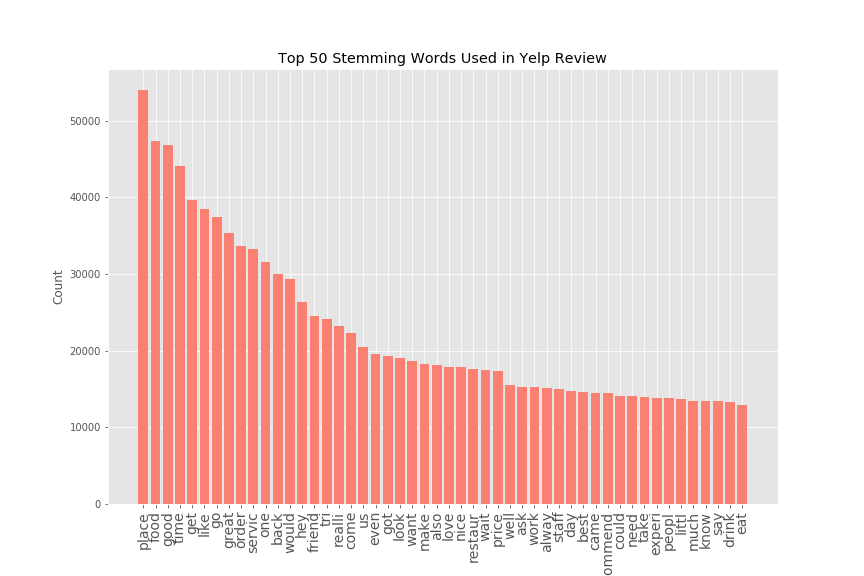 |  |

| *Top 50 Lemmatized Words:* | *Lemaatized Word Cloud:* |
| ----- | ----- |
| 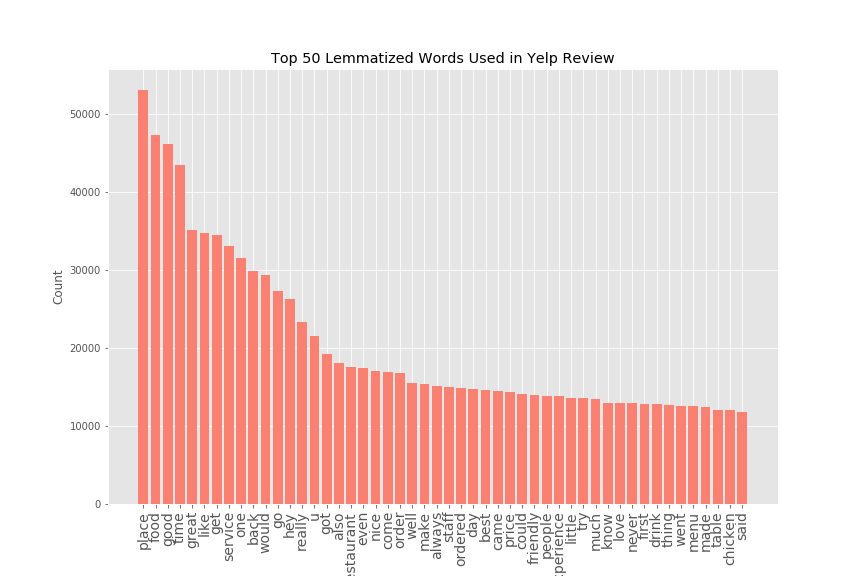 | 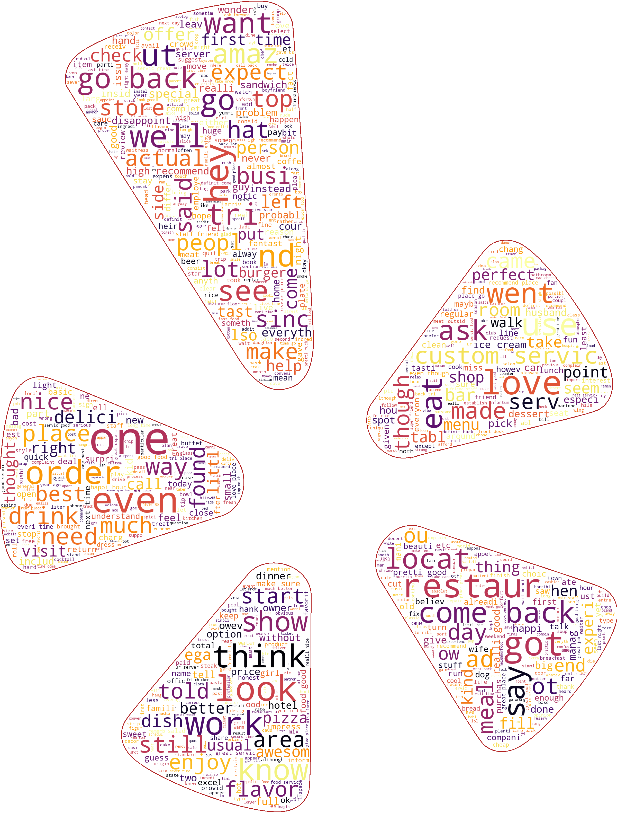 |

| Rating Frequency |
| :-----: |
| 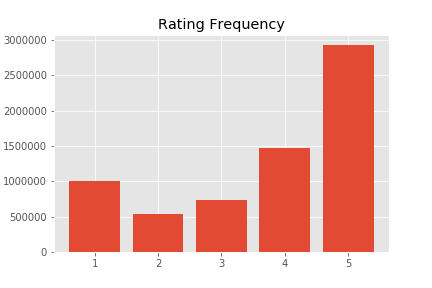 |

## Models and Performances
***
To predict review text and stars given, the following four classifiers are used:

- Naive Bayes
- Stochastic Gradient Descent
- Ada Boost
- Multi-Layer Perception

All produced around Mid 80% accuracy with the models better at classifying 1 star and 5 star ratings. Below are the model performances:

| Stemmed Naive Bayes ROC Curve | Stemmed Naive Bayes Precision Recall Curve |
| :-----: | :-----: |
|  |  |
| Lemmatized Naive Bayes ROC Curve | Lemmatized Naive Bayes Precision Recall Curve |
| 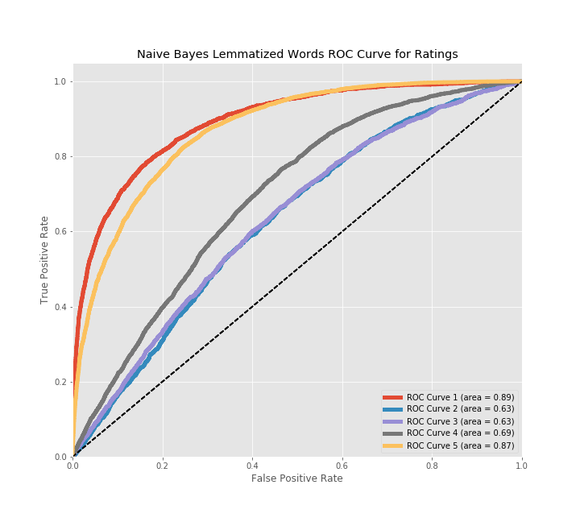 | 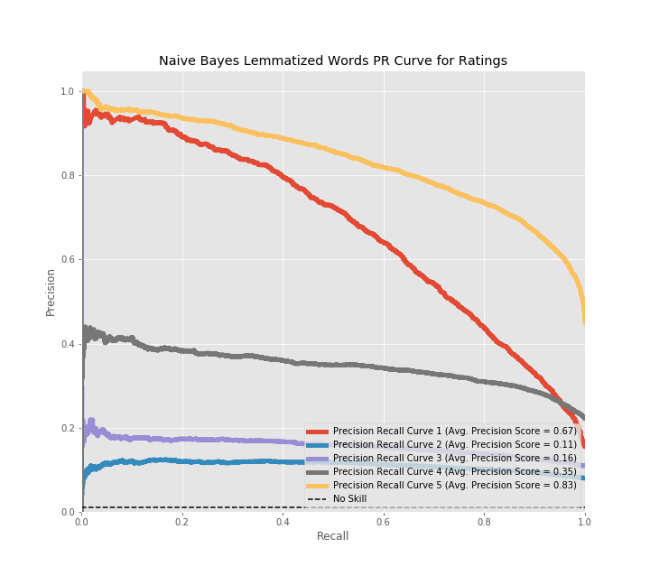 |
| Stemmed Stochastic GD ROC Curve | Stemmed Stochastic GD Precision Recall Curve |
|  | 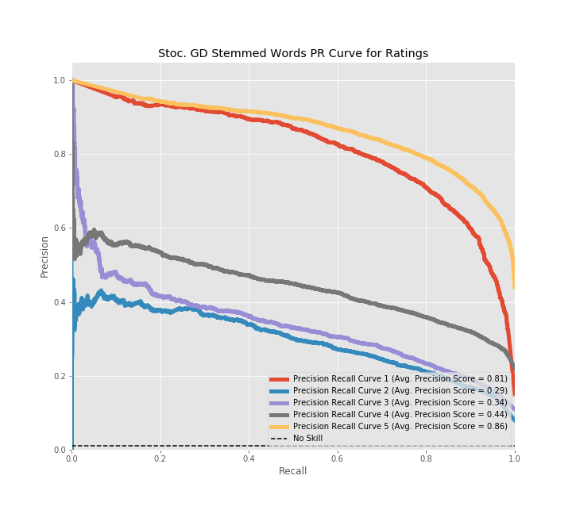 |
| Lemmatized Stochastic GD ROC Curve | Lemmatized Stochastic GD Precision Recall Curve |
| 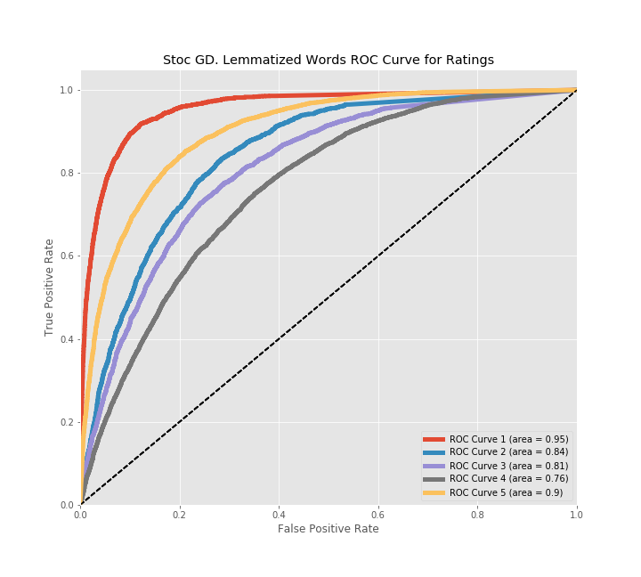 | 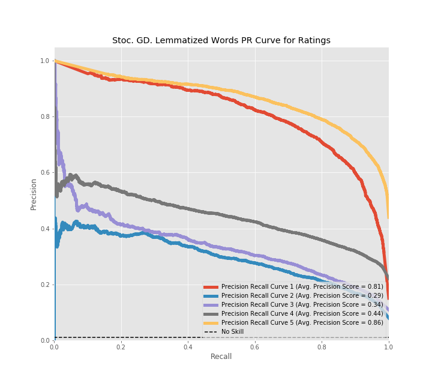 |
| Stemmed Ada Boost ROC Curve | Stemmed Ada Boost Precision Recall Curve |
|  | 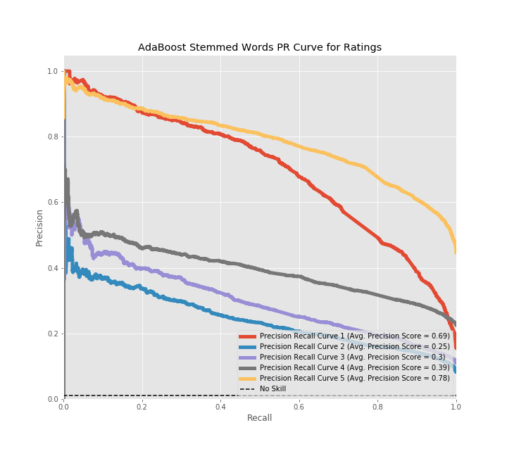 |
| Lemmatized Ada Boost ROC Curve | Lemmatized Ada Boost Precision Recall Curve |
| 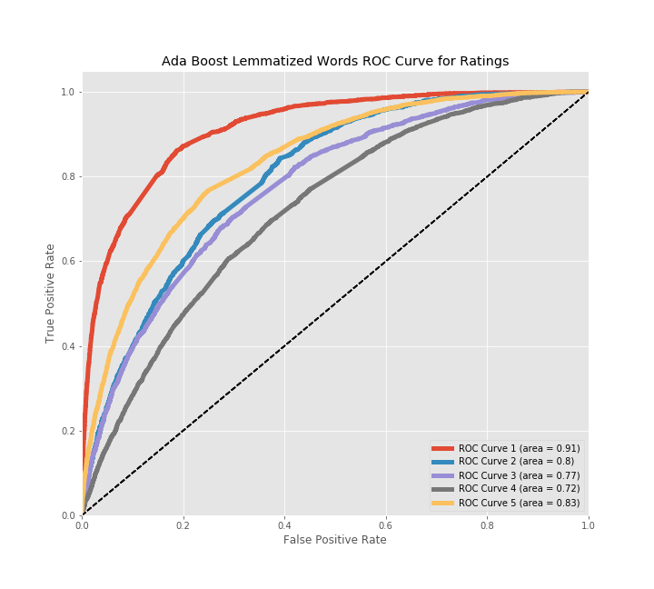 |  |
| Stemmed MLP ROC Curve | Stemmed MLP Precision Recall Curve |
| 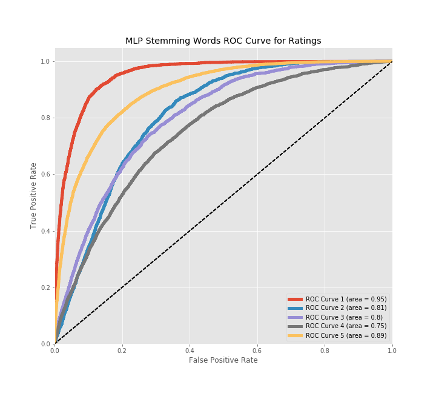 | 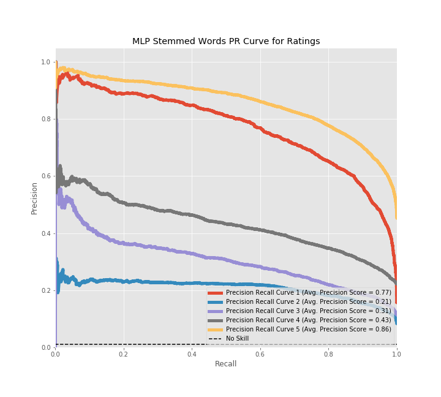 |
| Lemmatized MLP ROC Curve | Lemmatized MLP Precision Recall Curve |
| 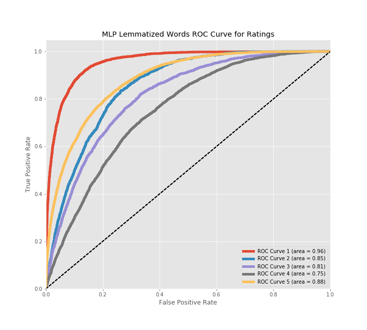 | 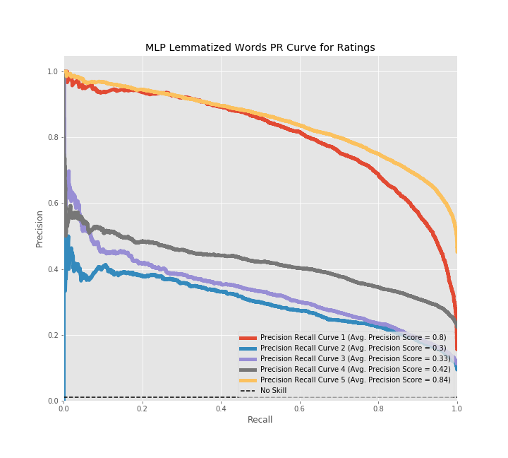 |
